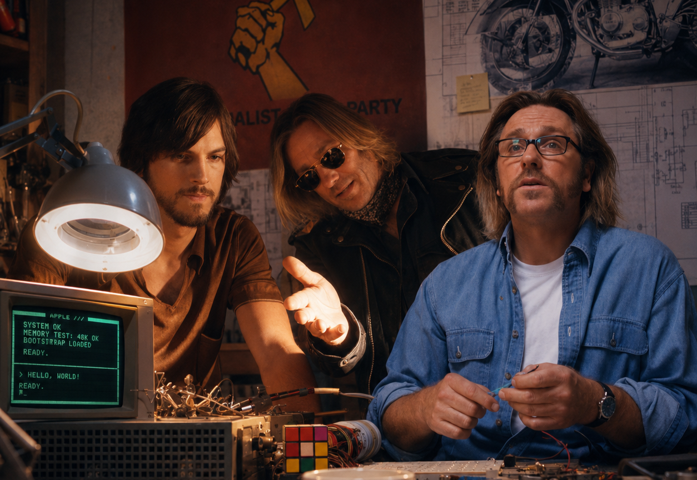

## Howdy! 👋

I'm Roy, a software engineer with years of experience in client-side software development.

I ❤ open source and enjoy exploring new technologies. I'm currently learning and building with Go, while actively contributing to open-source projects.

If you're interested in Go, client-side development, or open source, feel free to connect with me and chat! 😊

## 🚀 Currently

- Learning and building with Go
- Exploring cloud-native technologies
- Contributing to open-source projects
